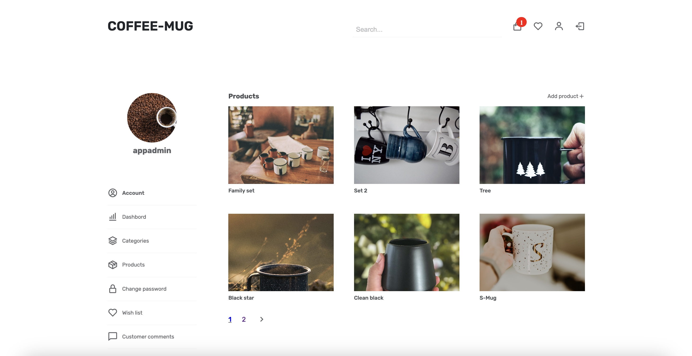
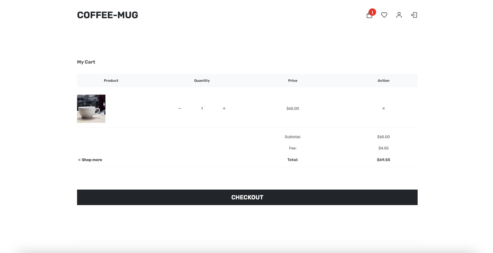
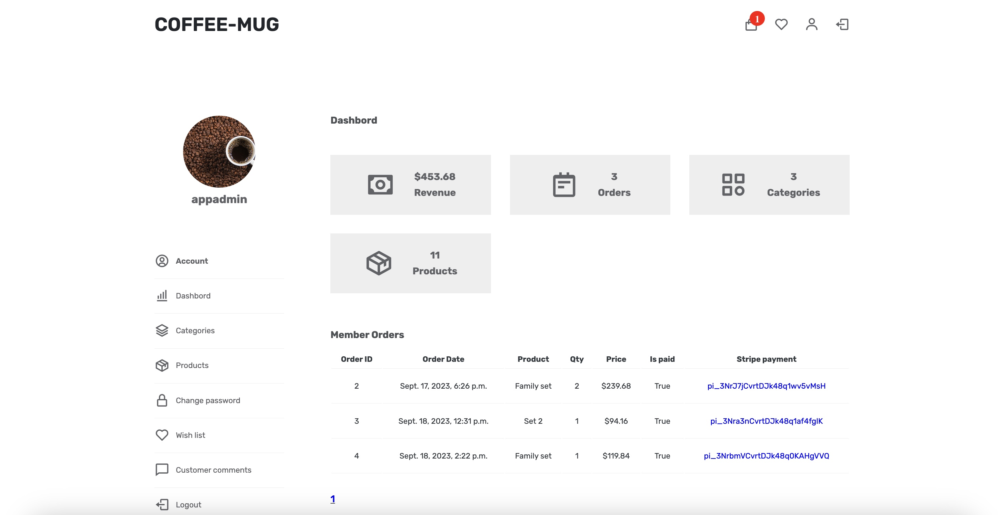

# django-coffee-mug-ecommerce

This is COFFEE-MUG responsive ecommerce website. On this website HTML, CSS and JS are implemented for the frontend and Django for the backend with a bit of Jquery.
Database is integrated with PostgreSQL.Website also implement celery for managing order queues and mornitor by flower, massage broker using RabbitMQ.

## Features:
## Admin/Staff
- Register/login account, activate account through link send to the email.
- Add/view category and product.
- Admin dashboard including orders/revenue/total product and total category.

## Member
- Register/login account, activate account through link send to the email.
- Password change/reset, verification link through email.
- Products/categories search functionality.
- Wishlist.
- Add/remove product from cart.
- Update cart item qty.
- Checkout.
- Give product review/comment.
- Give general comment for the website.

## Visitor
No register required.
- Products/categories search functionality.
- Add/remove product from cart.
- Update cart item qty.
- Checkout.
- Give general comment for the website.

## Sample screenshots.
## Products page

## Checkout page

## Admin dashboard page

